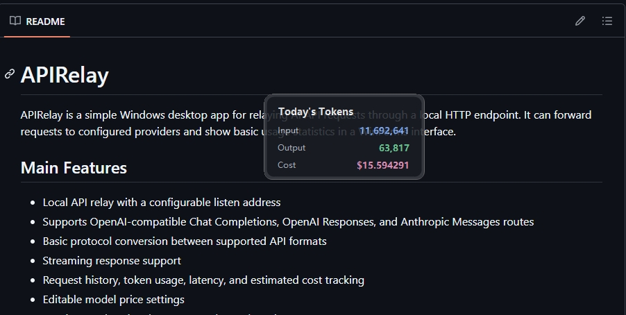
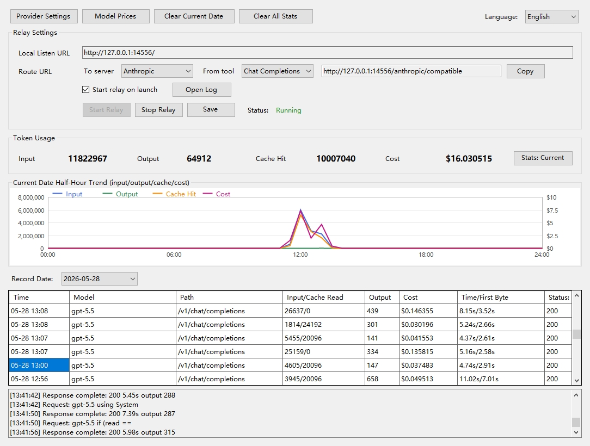

# APIRelay

APIRelay is a simple Windows desktop app for relaying AI API requests through a local HTTP endpoint. It can forward requests to configured providers and show basic usage statistics in a WinForms interface.

## Main Features

- Local API relay with a configurable listen address
- Supports OpenAI-compatible Chat Completions, OpenAI Responses, and Anthropic Messages routes
- Basic protocol conversion between supported API formats
- Streaming response support
- Request history, token usage, latency, and estimated cost tracking
- Editable model price settings
- Tray icon and optional auto-start relay on launch

## 

## Usage

1. Configure provider endpoints in the app.
2. Start the local relay, for example on `http://127.0.0.1:14556/`.
3. Point your client or tool to one of the local routes:

| Route | Description |
| --- | --- |
| `/compatible` | OpenAI-compatible Chat Completions |
| `/responses` | OpenAI Responses |
| `/anthropic` | Anthropic Messages |

## Requirements

- Windows
- .NET 8
